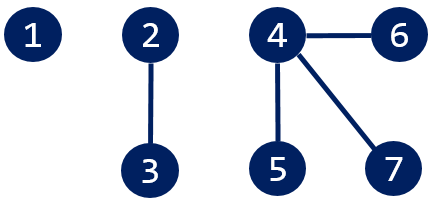
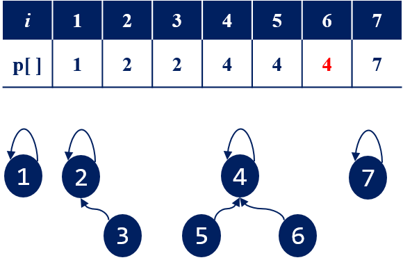

=====================
그룹 나누기
=====================

그래프 탐색
=======================

#. 입력 자료를 그래프로 저장한다.

.. code-block:: 

    7 4     // 정점수, 간선수
    2 3 4 5 4 6 7 4

위의 입력 자료에 해당하는 그래프는 다음과 같다.
        

#. 방문하지 않은 정점이  선택해서 그래프 탐색을 수행한다.  
    - 모든 정점을 방문할 때 까지 반복한다.
    
.. figure:: img/cc2.png
   :scale: 70%
   :align: center

3개의 연결 컴포넌트(connected component)가 존재한다.

Disjoint-Set 사용
=======================

#. 먼저 다음과 같이 Disjoint-Set을 초기화 한다.

.. figure:: img/group1.png
   :scale: 70%
   :align: center

#. union(2, 3) 
  
.. figure:: img/group2.png
   :scale: 70%
   :align: center   
 
#. union(4, 5)

.. figure:: img/group3.png
   :scale: 70%
   :align: center

#. union(4, 6)
   

   
#. union(7, 4)       
   
.. figure:: img/group6.png
   :scale: 70%
   :align: center        
   
   
   