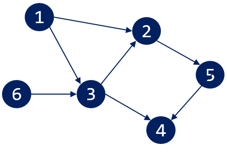
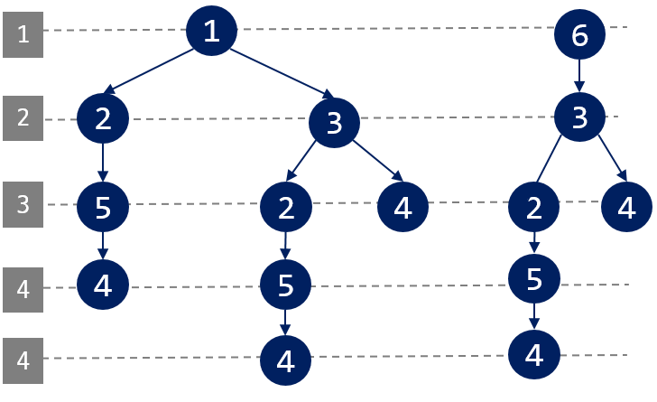
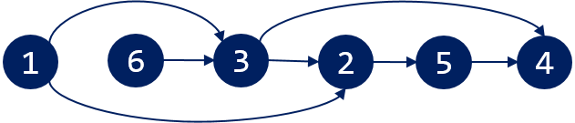
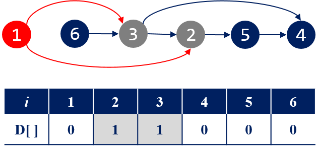
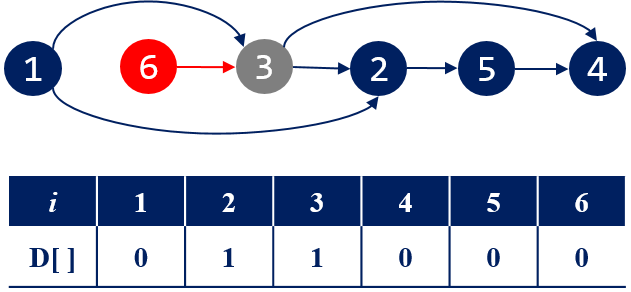
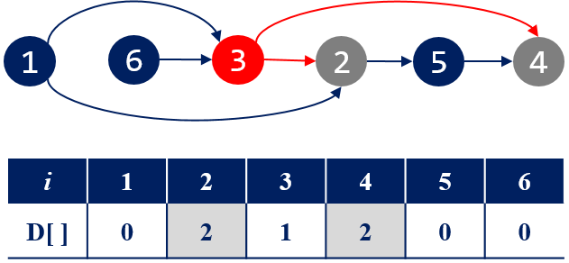
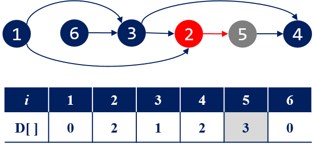
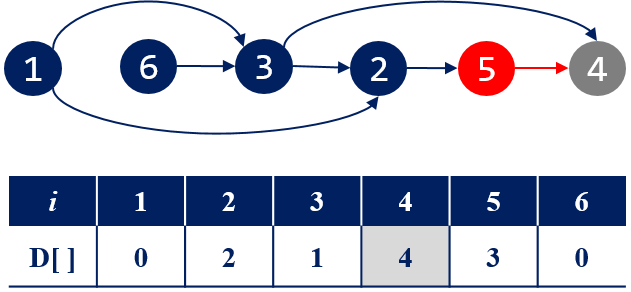

=====================
최소 동전 개수
=====================

트리 탐색 
============================

#. 입력 정보를 다음 그림과 같이 DAG 그래프로 저장한다.

모든 정점의 진입 차수를 계산한다. 진입 차수가 **0** 인 정점들을 찾는다.

#. 진입 차수가 **0** 인 정점 1, 6 을 시작점으로 트리(DFS 또는 BFS로) 탐색을 한다.
    - DAG는 싸이클이 없다.  

트리(그래프) 탐색으로 시작점에서 다른 정점까지의 최장 거리를 계산할 수 있다.

위상 정렬 
============================

#. 위상 정렬을 수행하면 최장 경로를 구할 수 있다.

위상 정렬된 순서로 정점을 선택(u)해서 인접 정점(v)에 대해 거리를 갱신한다.
    - D[v] = MAX( D[v], D[u] + weight(u,v) )

진입차수가 0인 정점의 D[] 값은 0으로 초기화한다. 간선의 가중치는 1을 더한다.
    
#. 1번 정점을 선택하고 계산한다.

#. 6번 정점을 선택하고 계산. 

#. 3번 정점을 선택하고 계산.

#. 2번 정점을 선택하고 계산.

#. 5번 정점을 선택하고 계산.

마지막 4번 정점에 대해서 할 일이 없다. D[]의 최대값 **4** 가 답이다. 

  