========================
추가 내용
========================

그룹 나누기
========================

그래프 탐색
------------------------

1. 입력 자료를 그래프로 저장한다.

.. code-block:: console

    7 4     // 정점수, 간선수
    2 3 4 5 4 6 7 4

위의 입력 자료에 해당하는 그래프는 다음과 같다.
        
.. figure:: img/cc1.png
    :scale: 60%
    :align: center

2. 방문하지 않은 정점을 선택해서 그래프 탐색을 수행한다.  
    - 모든 정점을 방문할 때 까지 반복한다.
    
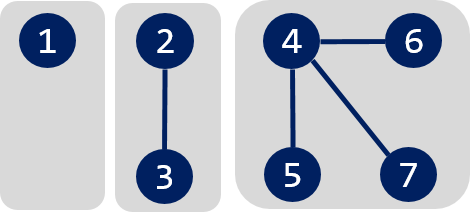
   

3개의 연결 컴포넌트(connected component)가 존재한다.

Disjoint-Set 사용
------------------------

1. 먼저 다음과 같이 Disjoint-Set을 초기화 한다.

.. figure:: img/group1.png
   :scale: 50%
   :align: center

2. union(2, 3) 
  
.. figure:: img/group2.png
   :scale: 50%   
   :align: center
 
3. union(4, 5)

.. figure:: img/group3.png
   :scale: 50%
   :align: center

4. union(4, 6)
   
.. figure:: img/group4.png
   :scale: 50%   
   :align: center
   
5. union(7, 4)       
   
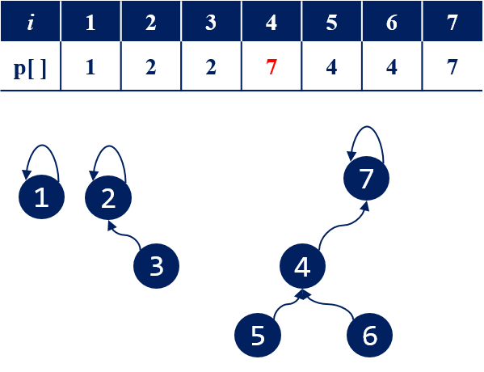

---------

최소 동전 개수
========================    

.. figure:: img/mincoin1.png
   :scale: 50%
   :align: center

.. figure:: img/mincoin2.png
   :scale: 50%
   :align: center

.. figure:: img/mincoin3.png
   :scale: 50%
   :align: center

.. figure:: img/mincoin4.png
   :scale: 50%
   :align: center

.. figure:: img/mincoin5.png
   :scale: 50%
   :align: center

.. figure:: img/mincoin6.png
   :scale: 50%
   :align: center

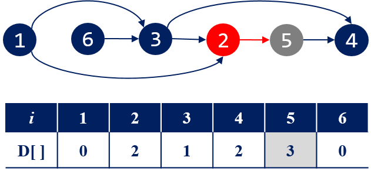

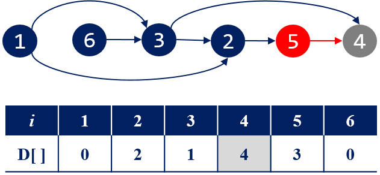

---------

구간 트리 - 구간합
=================

- Segment Tree
- 균형잡힌 이진 탐색 트리 형태(Balanced binary search tree)

- 하나의 노드는 하나의 구간을 나타낸다.
    - 루트는 전체 구간, 단말 노드는 하나의 자료에 대응

- 연속적으로 저장된 자료들에서 구간에 포함된 자료들의 합이나 구간의 자료들 중 최소값을 구하는 경우에 효율적이다.

    - 자료 값들의 변경이 빈번하게 발생
    - RSQ(Range Sum Query), RMQ(Range Minimum Query)

----------
    

구간 트리의 표현
----------------------------

- 트리의 높이에 대해 모든 노드들에 대한 공간을 확보한다.
- 이진 트리를 1차원 배열 형태로 표현한다. 
- 루트는 **1** 번에 해당하고 :math:`i` 번 노드의 왼쪽자식은 :math:`2 \times i` 이고 오른쪽 자식은 :math:`2 \times i + 1`

.. attention::
    
    - 자료수 N이 2의 거듭제곱이 아닐 수 있음에 주의한다.

8개의 정수형 자료들 {3, 9, 4, 2, 7, 8, 10, 1} 가 있다. 자료수 :math:`N = 8` 이므로 높이( :math:`h` ) 3인 구간 트리를 생성할 수 있다. 높이가 3인 트리의 최대 노드 수는 :math:`2^{h+1}` 이고 :math:`2N - 1` 과 같다.

전체 구간은 시작 인덱스 **0** 부터 마지막 인덱스 **7** (:math:`= N - 1` )까지가 된다.
루트 노드는 전체 구간에 대응하고, 루트의 두 자식 노드는 분할된 왼쪽과 오른쪽 구간에 대응된다.
이런식으로 분할 해서 시작과 끝이 같은 **8** 개의 노드(구간)가 생기고 **8** 개의 자료를 나타낸다.

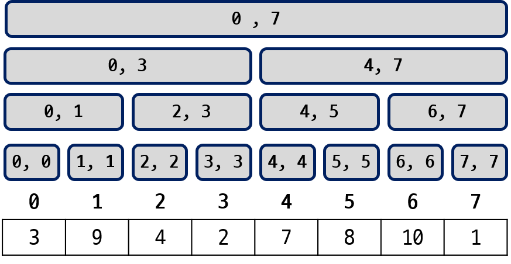
   
   < 8개의 자료에 대한 구간 트리 >

루트를 1번으로 왼쪽에서 오른쪽, 위에서 아래로 번호를 붙여가면 다음 그림과 같이 노드 번호를 부여할 수 있다.
노드 번호는 구간 트리를 저장하는 배열의 인덱스로 사용한다. 
1차원 배열로 저장된 트리에서 현재 방문하는 노드 번호가 :math:`i` 일때 :math:`2 \times i` 와 :math:`2 \times i + 1` 가 자식들이 된다.

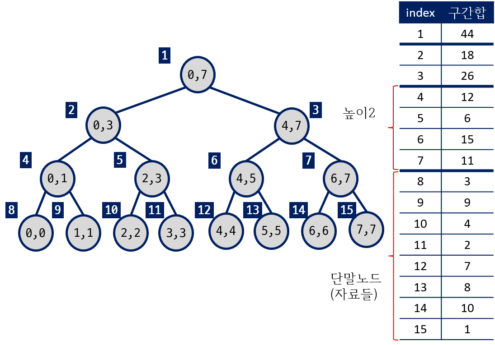

   < 1차 배열로 구간 트리 표현 > 

    
구간 트리 생성 하기    
---------------------------------

다음은 N 개의 자료들에 대한 구간 트리를 생성하는 코드이다.
   
.. literalinclude:: 구간트리_단일값갱신.java
    :language: java
    :linenos: 
    :lines: 6-16

 
다음과 같이 자료가 10개가 있다면 높이가 4인 구간 트리가 필요하다.    
   
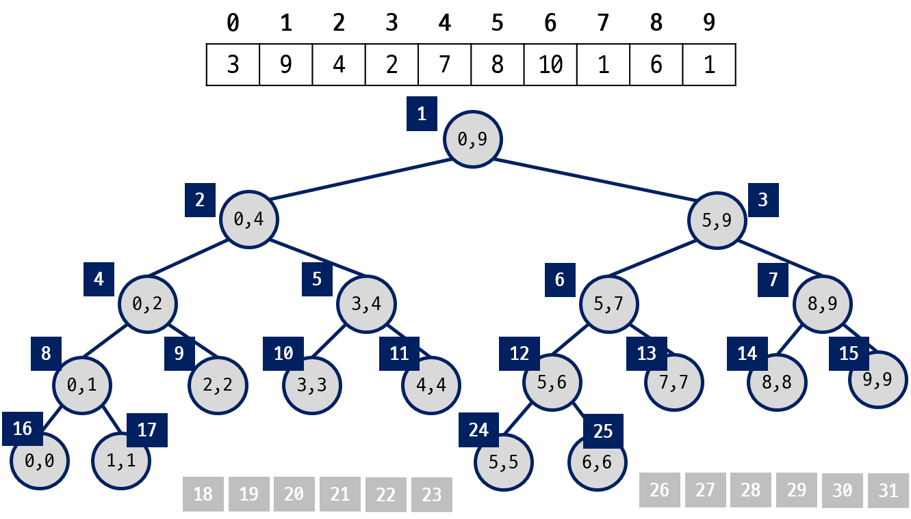

높이가 **4** 인 포화 이진 트리의 노드 수는 :math:`2^5 - 1` 이다.   
다음은 노드 수가 N일 때 구간 트리를 저장하는 배열의 크기를 계산하는 코드이다. 
그렇지 않다면, **vector** 클래스를 사용해서 구현할 수 있다.

.. literalinclude:: 구간트리_단일값갱신.java
    :language: java
    :linenos: 
    :lines: 38-44
   
   
구간 질의
----------------------------

다음 구간 트리에서 **[2, 6]** 구간의 합을 구하는 경우에 대해 생각해 보자.

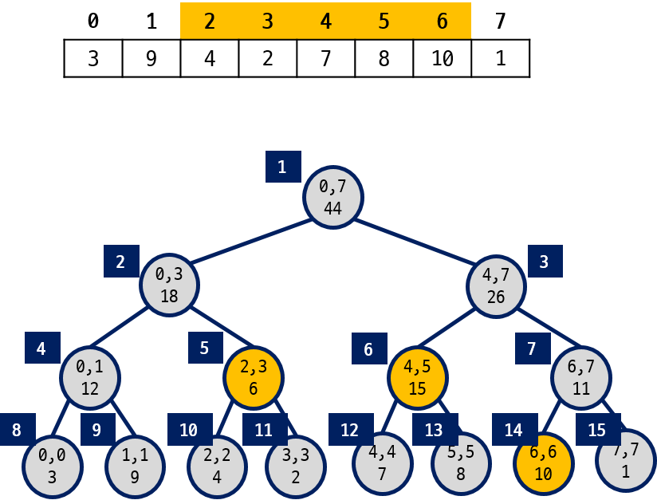

**[2, 6]** 에 대한 구간합은 구간 트리의  5, 6, 14 번 노드의 정보를 읽어야 한다. 루트 부터 트리를 순회하면서 구간합 질의에 필요한 노드(5, 6, 14)만 선택해서 읽을 수 있어야 한다.
   
구간의 포함 관계
~~~~~~~~~~~~~~~~~~~~~~~~~~~~~~

구간합을 계산할 때 질의 구간이 **[s, e]** 이고 구간 트리 각 노드의 구간이 **[l, r]** 이면 다음과 같은 3 가지 경우룰 구분해야 한다.

#. s ≤ l && r ≤ e 
    - 노드 구간 [l, r] 이 질의 구간 [s, e] 내에 포함된다.
    
#. r < s  ||  e < l
    - 노드 구간이 질의 구간의 범위 밖에 존재한다. 

#. 나머지
    - [l, r]이 [s, e]를 포함하는 경우.
    - 노드 구간과 질의 구간이 일부만 겹쳐진 경우
    
구간합 질의 구간이 [2, 6] 일때,

- (s ≤ l && r ≤ e)에 해당하는 노드는 5, 6, 14 이다.
- (r < s  ||  e < l) 인 노드는 4, 7 노드이다. 따라서, 4, 7 노드에 도착하면 순회를 중단하고 부모 노드로 돌아간다.
- 1(루트) 은 질의 구간을 포함하고, 2 와 3 은 [s, e]와 일부를 포함하고 있다. 따라서, 왼쪽/오른쪽 자식에 대한 순회를 계속한다.

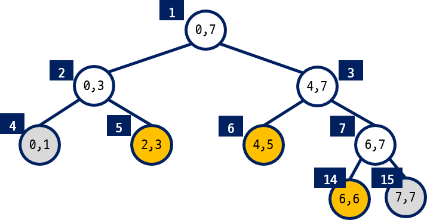
   
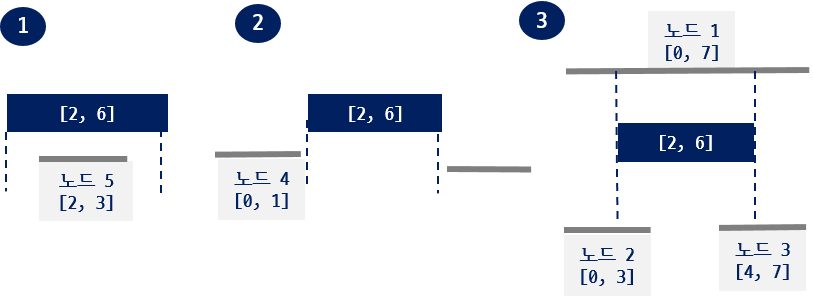
   
다음 그림은 **[0, 5]** 구간의 합을 구하는 경우이다.

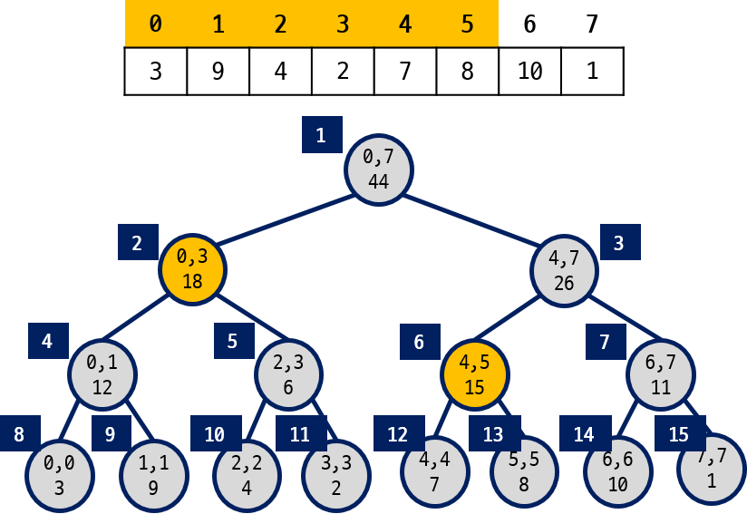

다음은 구간 **[a, b]** 에 포함된 자료들의 합을 구하는 코드이다.

.. literalinclude:: 구간트리_단일값갱신.java
    :language: java
    :linenos: 
    :lines: 17-25

단일 값 갱신
----------------------------

- 하나의 자료 값을 갱신하는 경우
- 구간에 포함된 자료 값들을 일괄적으로 갱신하는 경우

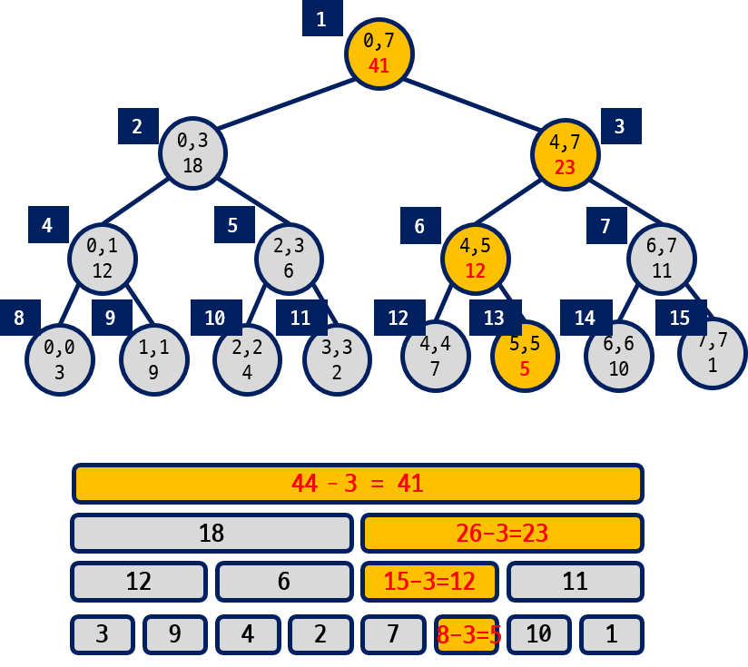
   
다음은 하나의 자료 값을 갱신하는 코드이다.

.. literalinclude:: 구간트리_단일값갱신.java
    :language: java
    :linenos: 
    :lines: 26-37
    
    
