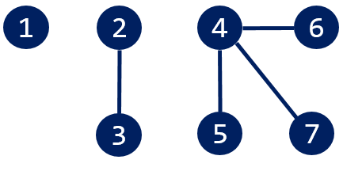
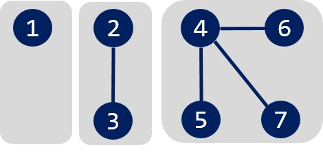
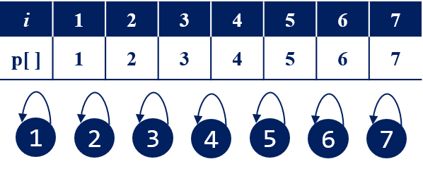
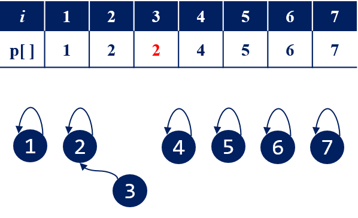
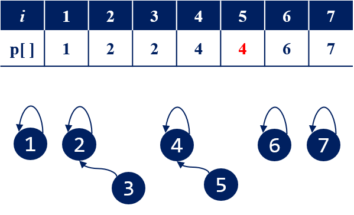
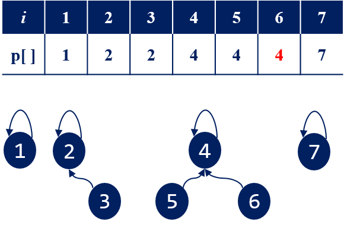
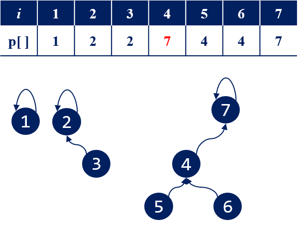

==================================
Day 01
==================================

.. contents:: 
   :depth: 1
   :local:

그룹 나누기
========================

그래프 탐색
------------------------

1. 입력 자료를 그래프로 저장한다.

.. code-block:: console

    7 4     // 정점수, 간선수
    2 3 4 5 4 6 7 4

위의 입력 자료에 해당하는 그래프는 다음과 같다.
        

2. 방문하지 않은 정점을 선택해서 그래프 탐색을 수행한다.  
    - 모든 정점을 방문할 때 까지 반복한다.
    

   

3개의 연결 컴포넌트(connected component)가 존재한다.

- `DFS 예제 <https://github.com/prolecture/problems/blob/master/JavaSrc/day01/그룹나누기_DFS.java>`_

Disjoint-Set 사용
------------------------

1. 먼저 다음과 같이 Disjoint-Set을 초기화 한다.

2. union(2, 3) 
  

 
3. union(4, 5)

4. union(4, 6)
   

   
5. union(7, 4)       
   

           
- `disjoint-set 예제 <https://github.com/prolecture/problems/blob/master/JavaSrc/day01/그룹나누기_DisjointSet.java>`_

---------

최소 동전 개수
========================    

- `DFS <https://github.com/prolecture/problems/blob/master/JavaSrc/day01/최소동전개수_DFS.java>`_
- `위상 정렬 + 인접 행렬 <https://github.com/prolecture/problems/blob/master/JavaSrc/day01/최소동전개수_위상정렬.java>`_
- `위상 정렬 + 인접리스트  <https://github.com/prolecture/problems/blob/master/JavaSrc/day01/최소동전개수_인접리스트.java>`_

---------

구간합 구하기
========================

- `누적합 <https://github.com/prolecture/problems/blob/master/JavaSrc/day01/구간합구하기.java>`_
- `구간 트리 <https://github.com/prolecture/problems/blob/master/JavaSrc/day01/구간합구하기_구간트리.java>`_
    

