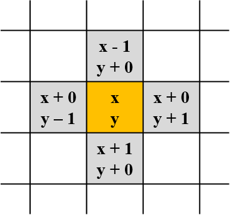
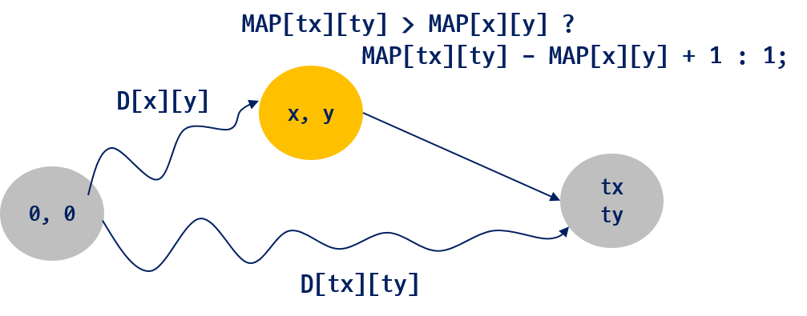

=========================
추가 내용
=========================

최소 연료 비용
=========================

.. tip::

    `최단 경로 참고 <http://algocoding.net/graph/shortest_path/index.html>`_

   
   < (x, y)의 상하좌우 인접한 셀 >

- MAP[][]: 지도 정보
- D[][]: 시작점(좌상단)에서 각 정점까지의 최단 거리 

    < (x, y)의 상하좌우 인접한 셀 >

.. code-block:: java

    int diff = (MAP[tx][ty] > MAP[x][y]) ? MAP[tx][ty] - MAP[x][y] + 1: 1;
     
    if(D[tx][ty] > D[x][y] + diff)
        D[tx][ty] = D[x][y] + diff;
