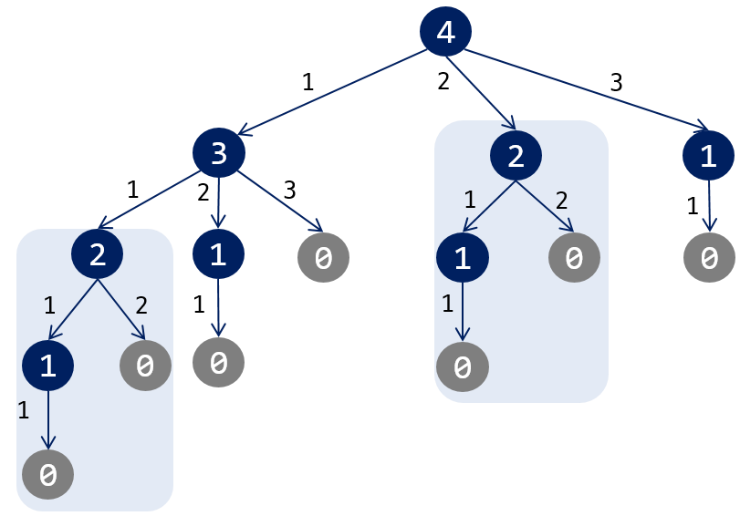
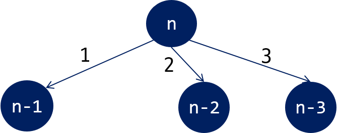
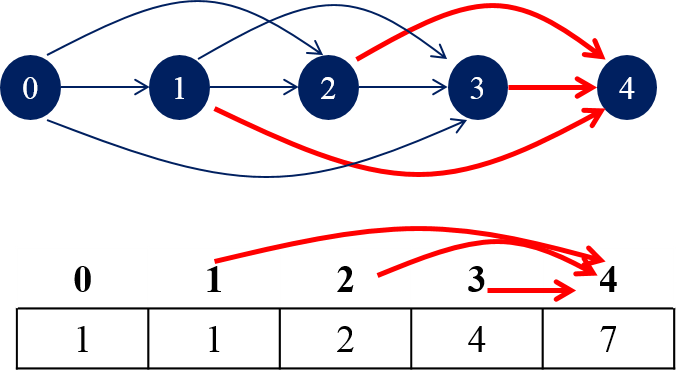

=============================
Day 02
=============================

.. contents:: 
   :depth: 1
   :local:
   
   
네 개의 수
=========================

    < 모든 경우의 수 >

- `brute-force 예제 <https://github.com/prolecture/problems/blob/master/JavaSrc/day02/네개의수_brute.java>`_

   
    < 문제들 간의 관계 >

점화식은 :math:`f(n) = f(n-1) + f(n-2) + f(n-3)` 이 된다.  주의할 것은 기저 사례는 :math:`f(0) = 1` 이다. 

메모이제이션을 통해 중복된 계산 작업을 줄일 수 있다.

- `재귀-메모 <https://github.com/prolecture/problems/blob/master/JavaSrc/day02/네개의수_재귀메모.java>`_

    < 테이블 채우기 >    

- `반복 <https://github.com/prolecture/problems/blob/master/JavaSrc/day02/네개의수_반복.java>`_

최단 거리
=========================

- `Dijkstra 예제 <https://github.com/prolecture/problems/blob/master/JavaSrc/day02/최단거리_Dijkstra.java>`_

최소 연료 비용
=========================

.. tip::

    `최단 경로 참고 <http://algocoding.net/graph/shortest_path/index.html>`_

.. figure:: img/delta.png
   :scale: 60%
   
   < (x, y)의 상하좌우 인접한 셀 >

- MAP[][]: 지도 정보
- D[][]: 시작점(좌상단)에서 각 정점까지의 최단 거리 

.. figure:: img/relaxation.png
   :scale: 60%
   
   < (x, y)의 상하좌우 인접한 셀 >

.. code-block:: java

    int diff = (MAP[tx][ty] > MAP[x][y]) ? MAP[tx][ty] - MAP[x][y] + 1: 1; 
    if(D[tx][ty] > D[x][y] + diff)
        D[tx][ty] = D[x][y] + diff;

- `BFS 예제 <https://github.com/prolecture/problems/blob/master/JavaSrc/day02/최소연료비용_BFS.java>`_

최장 증가 부분 수열
=========================

.. code-block:: console

    6      // 자료수
    1 6 3 4 5 2

각 자료로 끝나는 가장 긴 증가 수열들은 다음과 같다.

- 1로 끝나는 증가 수열: (1)
- 6로 끝나는 증가 수열: (1, 6)
- 3로 끝나는 증가 수열: (1, 3)
- 4로 끝나는 증가 수열: (1, 4), (1, 3, 4)
- 5로 끝나는 증가 수열: (1, 5), (1, 3, 5), (1, 4, 5), (1, 3, 4, 5)
- 2로 끝나는 증가 수열: (1, 2) 

5로 끝나는 증가 수열들은 1, 3, 4 로 끝나는 증가 수열들에 5를 추가 하면 된다. 6은 5보다 큰 값이기 때문에 6으로 끝나는 증가 수열 뒤에 5를 붙일 수 없다.   

- `DP 반복 <https://github.com/prolecture/problems/blob/master/JavaSrc/day02/LIS_DP.java>`_
- `이진 탐색 <https://github.com/prolecture/problems/blob/master/JavaSrc/day02/LIS_Binary.java>`_
- `구간 트리 <https://github.com/prolecture/problems/blob/master/JavaSrc/day02/LIS_구간트리.java>`_

최소 신장 트리
=========================

- `Prim 예제 <https://github.com/prolecture/problems/blob/master/JavaSrc/day01/최소신장트리_Prim.java>`_
- `Kruskal 예제 <https://github.com/prolecture/problems/blob/master/JavaSrc/day01/최소신장트리_Kruskal.java>`_
        