=========================
추가 내용
=========================

타일 붙이기
=========================

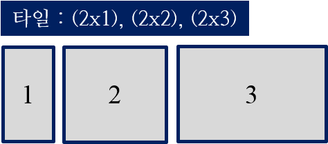

    < 3개의 타일 >

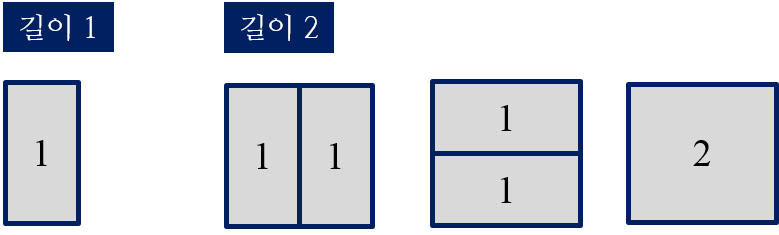
    
    < 길이 1 = 1가지, 길이 2 = 3가지 >

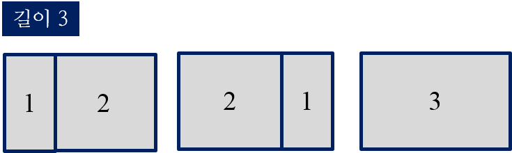
    
    < 길이 3 = 길이1 + 길이2 >

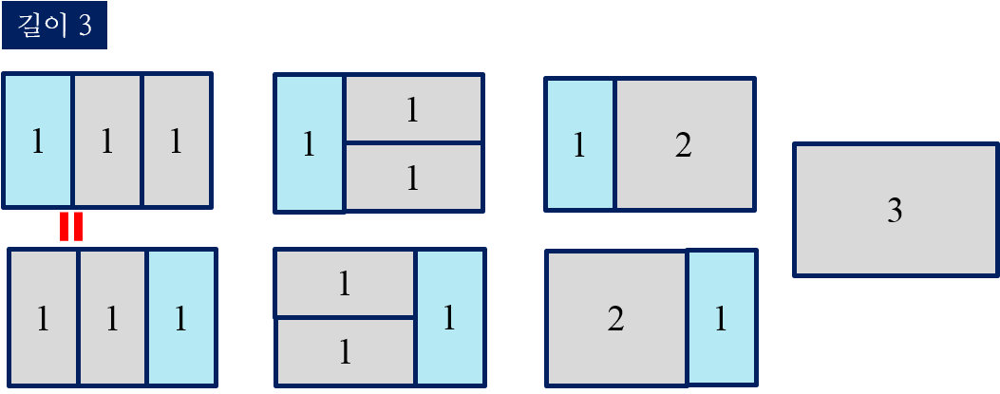

    < 길이 3에 대한 모든 방법 >
    
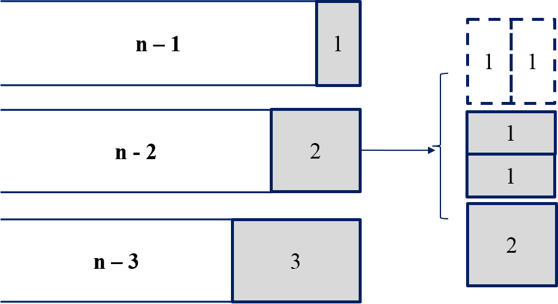
    
    < 길이 n >

- 점화식

.. math::  

    f(n) = 
    \begin{cases}        
        f(0) = 1, f(1) = 1, f(2) = 3,             & \text{n = 0, 1, 2}  \\[2ex]
        f(n - 1) + 2 \times f(n - 2) + f(n - 3), & {n \geq 3 }
    \end{cases}

-------

네 개의 수
=========================

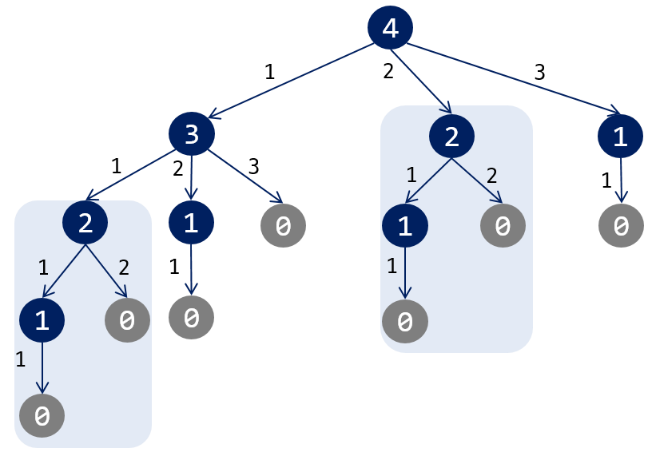

    < 모든 경우의 수 >

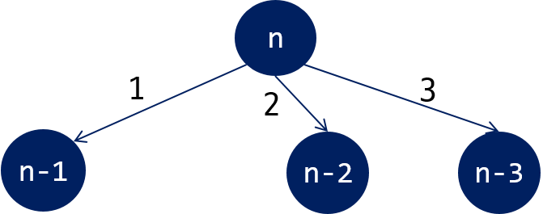
   
    < 문제들 간의 관계 >

점화식은 :

.. math::  

    f(n) = 
    \begin{cases}        
        1,                                       & \text{n = 0}  \\[2ex]        
        f(n - a_1) + 2 \times f(n - a_2) + f(n - a_3), & {n \geq a_1, a_2, a_3 }
    \end{cases} 

메모이제이션을 통해 중복된 계산 작업을 줄일 수 있다.

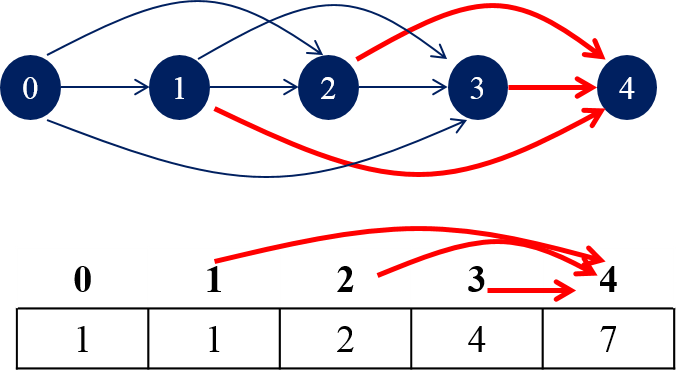

    < 테이블 채우기 >    

---------

최장 증가 부분 수열
=========================

.. code-block:: console

    6      // 자료수
    1 6 3 4 5 2

각 자료로 끝나는 가장 긴 증가 수열들은 다음과 같다.

- 1로 끝나는 증가 수열: (1)
- 6로 끝나는 증가 수열: (1, 6)
- 3로 끝나는 증가 수열: (1, 3)
- 4로 끝나는 증가 수열: (1, 4), (1, 3, 4)
- 5로 끝나는 증가 수열: (1, 5), (1, 3, 5), (1, 4, 5), (1, 3, 4, 5)
- 2로 끝나는 증가 수열: (1, 2) 

5로 끝나는 증가 수열들은 1, 3, 4 로 끝나는 증가 수열들에 5를 추가 하면 된다. 6은 5보다 큰 값이기 때문에 6으로 끝나는 증가 수열 뒤에 5를 붙일 수 없다.   

.. math::

    LIS(i) = (\max_{0 \le i \lt n} LIS[j]) + 1, a[j] < a[i], (0 \le j < i)
    
구간 최대값 활용:

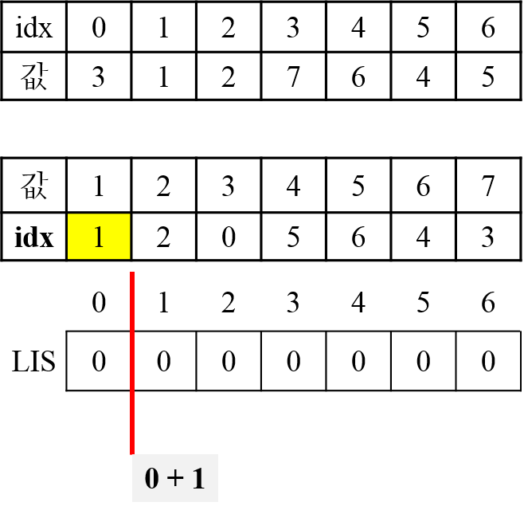

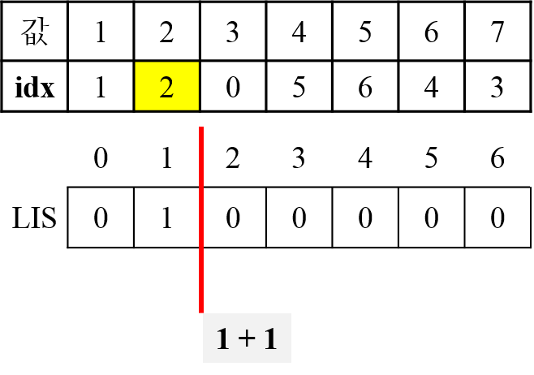

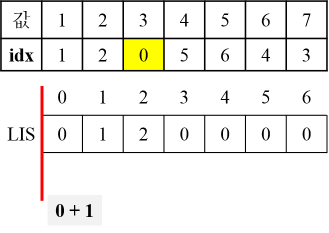

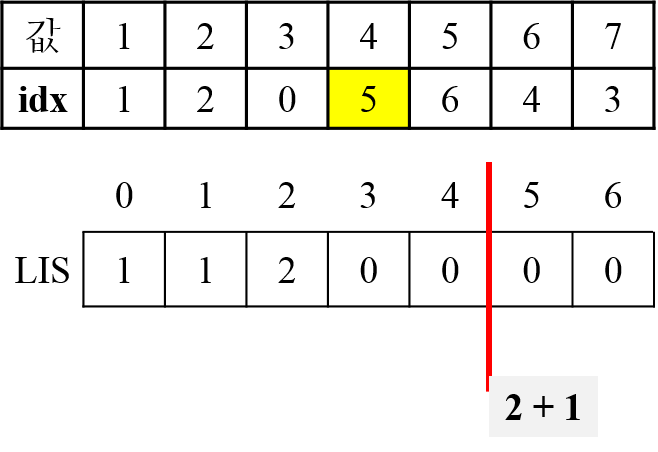

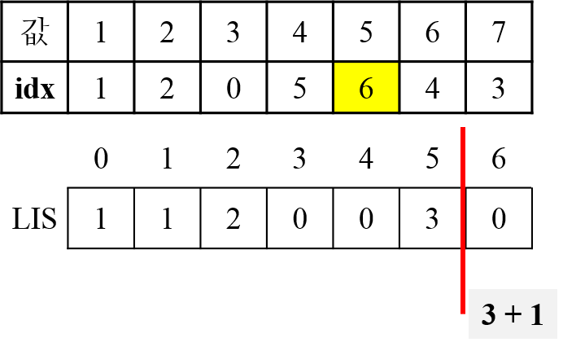

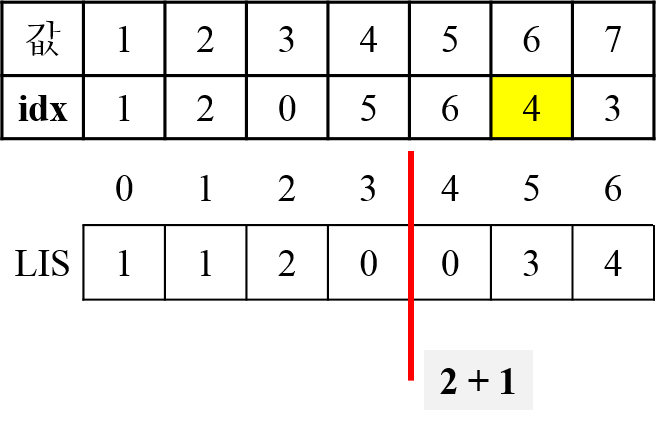

최장 거리
=========================

- 위상 정렬

-------

오른쪽 아래 이동
=========================

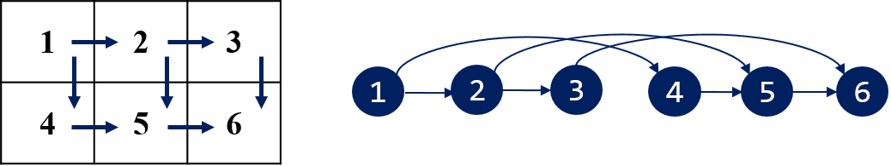

