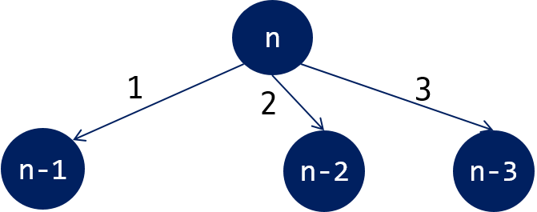

=============================
Day 03
=============================

.. contents:: 
   :depth: 1
   :local:

네 개의 수
=========================

.. figure:: img/fourNumber1.png
    :scale: 60%
    :align: center

    < 모든 경우의 수 >

- `brute-force 예제 <https://github.com/prolecture/problems/blob/master/JavaSrc/day03/네개의수_brute.java>`_

   
    < 문제들 간의 관계 >

점화식은 :math:`f(n) = f(n-1) + f(n-2) + f(n-3)` 이 된다.  주의할 것은 기저 사례는 :math:`f(0) = 1` 이다. 

메모이제이션을 통해 중복된 계산 작업을 줄일 수 있다.

- `재귀-메모 <https://github.com/prolecture/problems/blob/master/JavaSrc/day03/네개의수_재귀메모.java>`_

.. figure:: img/fourNumber3.png
    :scale: 60%
    :align: center

    < 테이블 채우기 >    

- `반복 <https://github.com/prolecture/problems/blob/master/JavaSrc/day03/네개의수_반복.java>`_

---------

최장 증가 부분 수열
=========================

.. code-block:: console

    6      // 자료수
    1 6 3 4 5 2

각 자료로 끝나는 가장 긴 증가 수열들은 다음과 같다.

- 1로 끝나는 증가 수열: (1)
- 6로 끝나는 증가 수열: (1, 6)
- 3로 끝나는 증가 수열: (1, 3)
- 4로 끝나는 증가 수열: (1, 4), (1, 3, 4)
- 5로 끝나는 증가 수열: (1, 5), (1, 3, 5), (1, 4, 5), (1, 3, 4, 5)
- 2로 끝나는 증가 수열: (1, 2) 

5로 끝나는 증가 수열들은 1, 3, 4 로 끝나는 증가 수열들에 5를 추가 하면 된다. 6은 5보다 큰 값이기 때문에 6으로 끝나는 증가 수열 뒤에 5를 붙일 수 없다.   

- `DP 반복 <https://github.com/prolecture/problems/blob/master/JavaSrc/day03/LIS_DP.java>`_
- `이진 탐색 <https://github.com/prolecture/problems/blob/master/JavaSrc/day03/LIS_Binary.java>`_
- `구간 트리 <https://github.com/prolecture/problems/blob/master/JavaSrc/day03/LIS_구간트리.java>`_

타일 붙이기
=========================

- `타일 붙이기(반복) <https://github.com/prolecture/problems/blob/master/JavaSrc/day03/타일붙이기_반복.java>`_
    
    
이항 계수
=========================
   
- `이항 계수 <https://github.com/prolecture/problems/blob/master/JavaSrc/day03/이항계수.java>`_

오른쪽 아래 이동
=========================
    
- `오른쪽-아래-이동3 <https://github.com/prolecture/problems/blob/master/JavaSrc/day03/오른쪽아래이동3.java>`_

암호 편지
=========================
   
- `암호 편지 <https://github.com/prolecture/problems/blob/master/JavaSrc/day03/암호편지.java>`_

최장 거리
=========================

- `최장 거리 <https://github.com/prolecture/problems/blob/master/JavaSrc/day03/최장거리.java>`_

