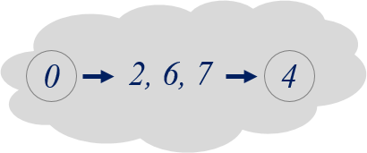
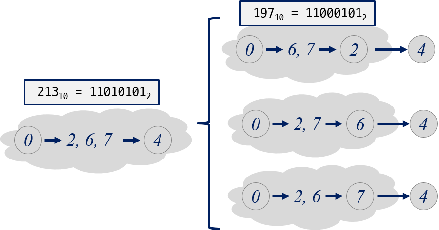

=========================
추가 설명
=========================

행렬 곱셈
=========================

:math:`n \times m` 행렬과 :math:`m \times p` 행렬은 곱셈이 가능하다. 다음과 같이 :math:`A` 는 :math:`2 \times 2` 행렬이고, :math:`B` 는 :math:`2 \times 3` 행렬이므로 곱셈이 가능하다.

.. math::

    \begin{eqnarray}
        A = \left(
          \begin{array}{cc}
            a_{ 11 } & a_{ 12 }\\
            a_{ 21 } & a_{ 22 }\\                        
          \end{array}
        \right)
        ,         
        B = \left(
          \begin{array}{cc}
            b_{ 11 } & b_{ 12 } & b_{13} \\
            b_{ 21 } & b_{ 22 } & b_{23}\\                                    
          \end{array}
        \right)
    \end{eqnarray}

행렬 곱셈의 결과는 :math:`2 \times 3` 행렬이 된다. 

.. math::

    \begin{eqnarray}
        AB = \left(
          \begin{array}{ccc}
            a_{11} \cdot b_{11} + a_{12} \cdot b_{21} & a_{11} \cdot b_{12} + a_{12} \cdot b_{22} & a_{11} \cdot b_{13} + a_{12} \cdot b_{23}\\            
            a_{21} \cdot b_{11} + a_{22} \cdot b_{21} & a_{21} \cdot b_{12} + a_{22} \cdot b_{22} & a_{21} \cdot b_{13} + a_{22} \cdot b_{23} \\            
          \end{array}
       \right)
    \end{eqnarray}

이 과정에서 필요한 행렬 원소들 사이의 곱셈 횟수는 :math:`12 (= 2 \times 2 \times 3)` 번이고 :math:`AB` 행렬의 각 원소마다 **2** 번의 곱셈이 필요하다.

:math:`n \times m` 행렬과 :math:`m \times p` 행렬을 곱하면 :math:`n \times p` 행렬이 되고, 필요한 곱셈 횟수는 :math:`n \times m \times p` 가 된다.

:math:`{A_1 \times A_2 \times A_3}` 와 같이 **3** 개의 행렬을 곱하는 방법은 다음 두 가지이다.

1. :math:`{(A_1 \times A_2) \times A_3}`
2. :math:`{A_1 \times (A_2 \times A_3)}` 

행렬의 행과 열의 크기에 따라 원소들 간의 곱하는 횟수는 달라진다.

:math:`{A_1, A_2, A_3}` 의 행렬의 크기가 각각 :math:`{(2,3), (3,4), (4,5)}` 일때,  첫 번째는 **64** 번, 두 번째 방법은 **90** 번의 곱셈이 필요하다.

연속 행렬 곱셈 문제는 곱셈이 가능한 연속적인 **n** 개의 행렬에 대해 최소 곱셈 회수로 행렬 곱셈을 하는 방법을 찾는 문제이다.

부분 문제 정의
==============================

.. math::

    \begin{array}{c}
        \underline{A_1 \times \cdots \times A_i} \times \underline{A_{i+1} \times \cdots \times A_n} \\
        A_{left} \times A_{right}    
    \end{array}
    

점화식
----------------------

.. math::  

    M[i, j] =     
    \begin{cases}            
        0,                                     & {, \; i = j}   \\[2ex]               
        \underset{i \le k \le j}{min} { \{ M[i, k] + M[k + 1, j] + row_i \cdot col_k \cdot col_j \} } & {, \; i < j}
    \end{cases}
    

TSP + DP
=========================

순회 외판원 문제(TSP,Traveling Salesman Person)에 동적 계획법 적용해보자.

정점(요소)의 수가 많지 않을 경우 방문한 정점들의 집합을 비트로 표현할 수 있다. 방문한 정점들의 집합을 공집합에서 시작해서 크기가 V–1 인 집합까지 구해 나간다.

방문한 정접 집합으로 문제 표현
=========================================

D[방문한 집합][마지막 정점]:

- D[{0,2,4,6,7}][4]
- {0,2,4,6,7}은 방문한 정점들의 집합
- 4는 마지막으로 방문한 정점

시작점 0에서 {2, 6, 7}을 임의의 순서로 방문하고 4로 가는 최단 경로의 가중치 합을 의미한다.

{0,2,4,6,7}은 이진수 **11010101** 로 표현할 수 있다.

부분 문제
=========================================    

정점 집합이 {0, 1, 2, 3, 4, 5}이고, 정점 0 이 시작 정점이라면, 경로는 항상 0번 부터 시작한다.

- D[ {0} ][0] =  0 

정점수가 N일때, 정점들의 부분 집합은 크기가 **1** 부터 **N** 까지 부분집합들이 있다. 반드시 0번 정점은 먼저 방문해야 하므로 크기 **2** 인 부분 집합부터 고려한다.

시작점 다음으로 방문할 정점들을 선택하고 거리를 계산한다.    

- D[{0, 1}][1] = D[{0}][0] + G[0][1]
- D[{0, 2}][2] = D[{0}][0] + G[0][2]
- D[{0, 3}][3] = D[{0}][0] + G[0][3]
- D[{0, 4}][4] = D[{0}][0] + G[0][4]
- D[{0, 5}][5] = D[{0}][0] + G[0][5]

크기가 2인 정점 집합들에 대해서 계산이 끝난다.

두 번째로 방문할 정점들을 선택한다. 크기가 3인 정점들의 집합에 대해서 계산한다. 크기 2인 정점 집합들이 이미 계산되었다면 다음과 같이 구할 수 있다.

예를 들어, 이미 방문한 정점 집합 {0, 1}에  나머지 정점 중에 하나를 선택해서 포함한다.

2번 정점을 포함:

- D[{0, 1, 2}][1] = D[{0, 2}][2] + G[2][1]  // 0->2->1
- D[{0, 1, 2}][2] = D[{0, 1}][1] + G[1][2]  // 0->1->2

3번 정점을 포함:

- D[{0, 1, 3}][1] = D[{0, 3}][3] + G[3][1]  // 0->1->3
- D[{0, 1, 3}][3] = D[{0, 1}][1] + G[1][3]  // 0->3->1

이와 같이 크기 3인 모든 정점 집합에 대해서 계산할 수 있다.
    
따라서, 우리가 구하려는 문제가 D[{0,2,4,6,7}][4]일때, 다음과 같이 구할 수 있다.

D[{0,2,4,6,7}][4]
   = MIN { 
            D[{0,2,6,7}][2] + G[2][4],
            
            D[{0,2,6,7}][6] + G[6][4], 
            
            D[{0,2,6,7}][7] + G[6][4], }

