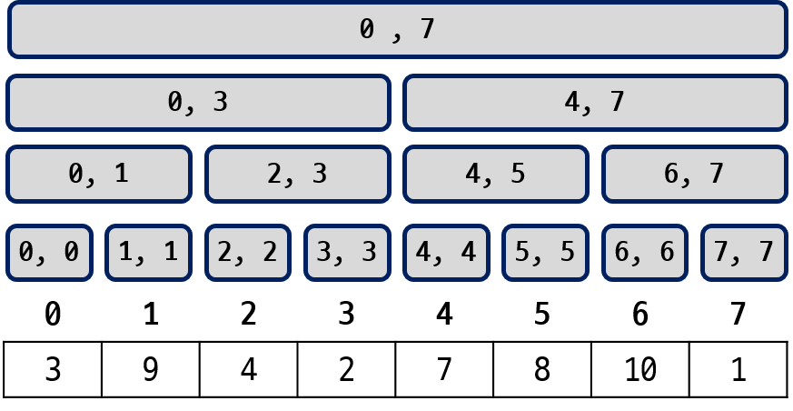
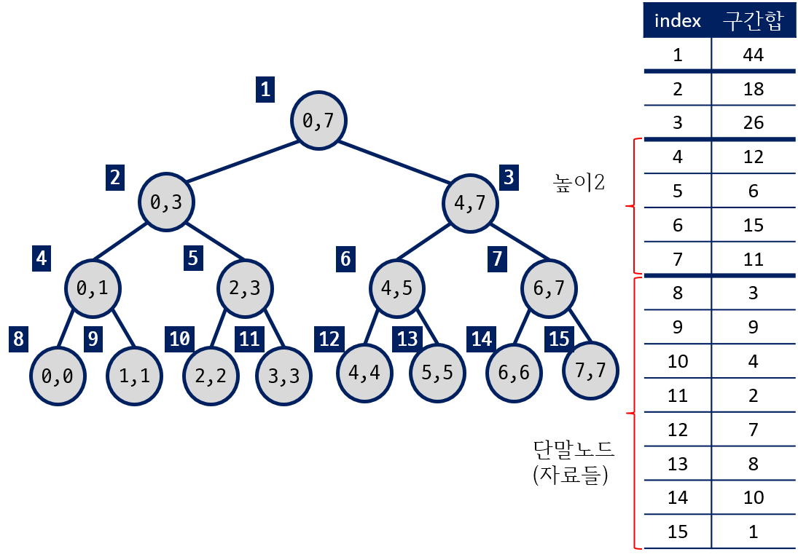
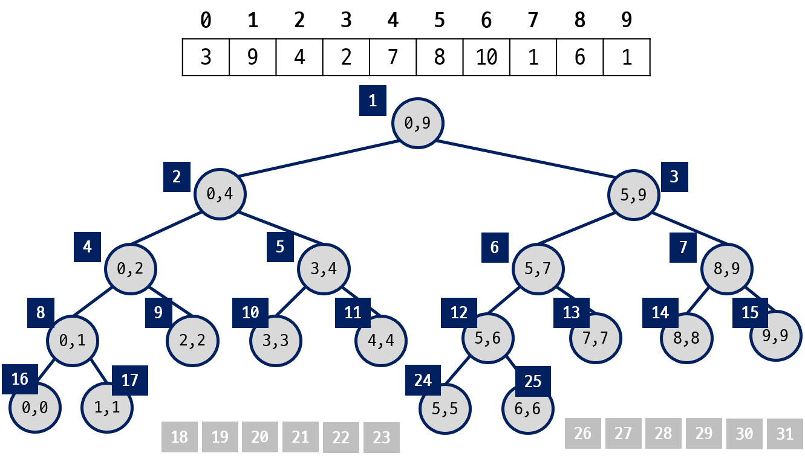
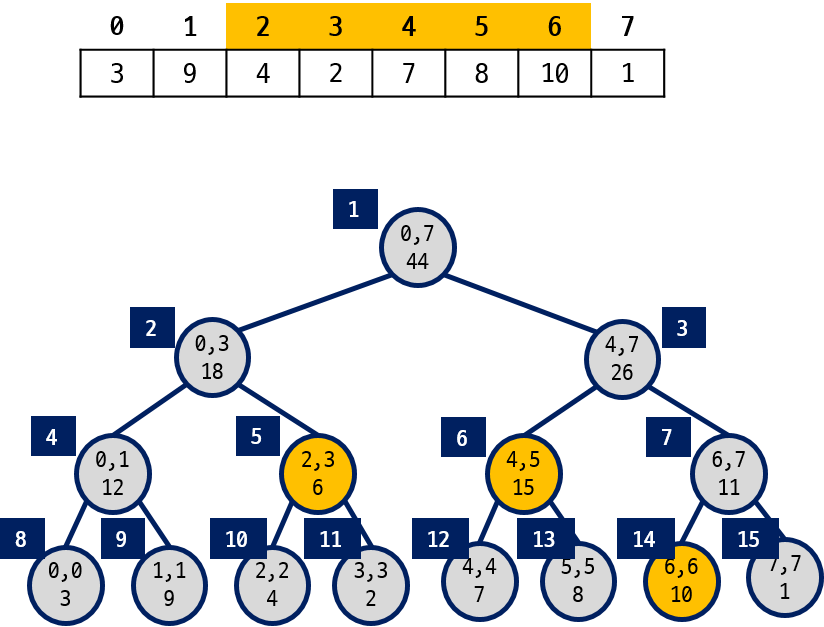
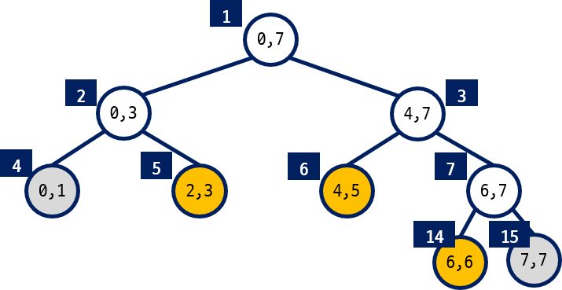
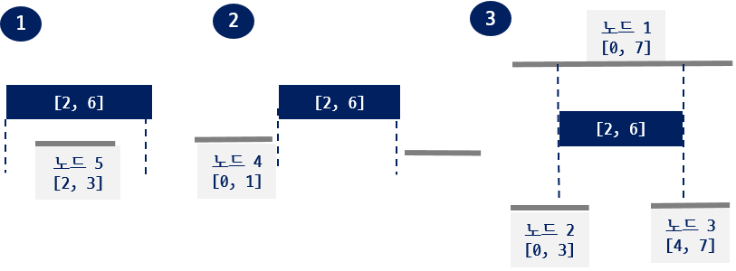
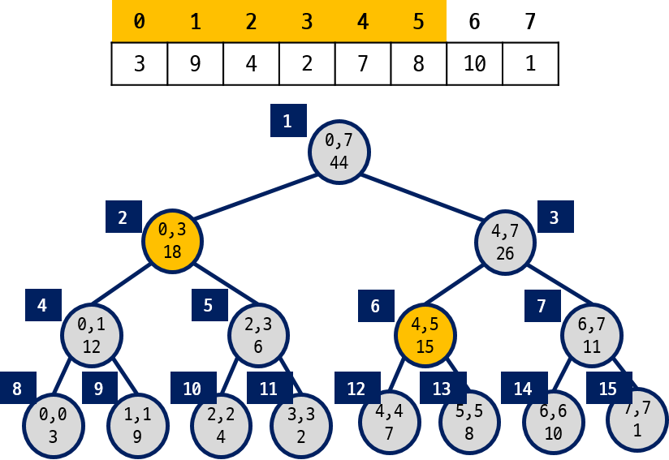

==================================
Java 라이브러리
==================================

.. contents:: 
   :depth: 1
   :local:
   
라이브러리 예제
==================================

정렬
---------------

다음은 정렬 관련 라이브러리 사용 예제이다.

#. `Array 정렬 <https://github.com/prolecture/problems/blob/master/JavaSrc/src/SortArrayDemo.java>`_
#. 객체 정렬 
    - `Comparator <https://github.com/prolecture/problems/blob/master/JavaSrc/src/SortComparatorDemo.java>`_
    - `Comparable <https://github.com/prolecture/problems/blob/master/JavaSrc/src/SortComparableDemo.java>`_
#. `binary Search <https://github.com/prolecture/problems/blob/master/JavaSrc/src/BinarySearchDemo.java>`_

자료구조 예제
-----------------

다음은 자료구조 크래스에 대한 사용 예제이다.

#. `Stack <https://github.com/prolecture/problems/blob/master/JavaSrc/src/StackDemo.java>`_
#. `Queue <https://github.com/prolecture/problems/blob/master/JavaSrc/src/QueueDemo.java>`_
#. `LinkedList <https://github.com/prolecture/problems/blob/master/JavaSrc/src/LinkedListDemo.java>`_
#. `Vector <https://github.com/prolecture/problems/blob/master/JavaSrc/src/VectorDemo.java>`_
#. `TreeSet <https://github.com/prolecture/problems/blob/master/JavaSrc/src/TreeSetDemo.java>`_
#. `HashMap <https://github.com/prolecture/problems/blob/master/JavaSrc/src/HashMapDemo.java>`_

우선 순위 큐
======================

#. `이진 힙(Binary Heap) 참고 내용 <http://algocoding.net/tree/heap.html>`_
    - `Java 예제 <https://github.com/prolecture/problems/blob/master/JavaSrc/src/이진힙.java>`_

#. PrioirtyQueue 클래스 사용하기 
    - `정수 자료형 <https://github.com/prolecture/problems/blob/master/JavaSrc/src/PQDemo1.java>`_
    - `객체 자료형 <https://github.com/prolecture/problems/blob/master/JavaSrc/src/PQDemo2.java>`_

구간 트리
=================

- Segment Tree
- 균형잡힌 이진 탐색 트리 형태(Balanced binary search tree)

- 하나의 노드는 하나의 구간을 나타낸다.
    - 루트는 전체 구간, 단말 노드는 하나의 자료에 대응

- 연속적으로 저장된 자료들에서 구간에 포함된 자료들의 합이나 구간의 자료들 중 최소값을 구하는 경우에 효율적이다.

    - 자료 값들의 변경이 빈번하게 발생
    - RSQ(Range Sum Query), RMQ(Range Minimum Query)

------------
    

구간 트리의 표현
----------------------------

- 트리의 높이에 대해 모든 노드들에 대한 공간을 확보한다.
- 이진 트리를 1차원 배열 형태로 표현한다. 
- 루트는 **1** 번에 해당하고 :math:`i` 번 노드의 왼쪽자식은 :math:`2 \times i` 이고 오른쪽 자식은 :math:`2 \times i + 1`

.. attention::
    
    - 자료수 N이 2의 거듭제곱이 아닐 수 있음에 주의한다.

8개의 정수형 자료들 {3, 9, 4, 2, 7, 8, 10, 1} 가 있다. 자료수 :math:`N = 8` 이므로 높이( :math:`h` ) 3인 구간 트리를 생성할 수 있다. 높이가 3인 트리의 최대 노드 수는 :math:`2^{h+1}` 이고 :math:`2N - 1` 과 같다.

전체 구간은 시작 인덱스 **0** 부터 마지막 인덱스 **7** (:math:`= N - 1` )까지가 된다.
루트 노드는 전체 구간에 대응하고, 루트의 두 자식 노드는 분할된 왼쪽과 오른쪽 구간에 대응된다.
이런식으로 분할 해서 시작과 끝이 같은 **8** 개의 노드(구간)가 생기고 **8** 개의 자료를 나타낸다.

   
   < 8개의 자료에 대한 구간 트리 >

루트를 1번으로 왼쪽에서 오른쪽, 위에서 아래로 번호를 붙여가면 다음 그림과 같이 노드 번호를 부여할 수 있다.
노드 번호는 구간 트리를 저장하는 배열의 인덱스로 사용한다. 
1차원 배열로 저장된 트리에서 현재 방문하는 노드 번호가 :math:`i` 일때 :math:`2 \times i` 와 :math:`2 \times i + 1` 가 자식들이 된다.

   < 1차 배열로 구간 트리 표현 > 
   
.. literalinclude:: code/구간트리_구간나누기.java
    :language: java
    :linenos:
    :lines: 6-14
    
구간 트리 생성 하기    
---------------------------------

다음은 N 개의 자료들에 대한 구간 트리를 생성하는 코드이다.
   
.. literalinclude:: code/구간트리_단일값갱신.algo
    :language: java
    :linenos: 
    :lines: 7-16

 
다음과 같이 자료가 10개가 있다면 높이가 4인 구간 트리가 필요하다.    
   

높이가 **4** 인 포화 이진 트리의 노드 수는 :math:`2^5 - 1` 이다.   
다음은 노드 수가 N일 때 구간 트리를 저장하는 배열의 크기를 계산하는 코드이다. 
그렇지 않다면, **vector** 클래스를 사용해서 구현할 수 있다.

.. literalinclude:: code/구간트리_단일값갱신.algo
    :language: java
    :linenos: 
    :lines: 38-44
   
   
구간 질의
----------------------------

다음 구간 트리에서 **[2, 6]** 구간의 합을 구하는 경우에 대해 생각해 보자.

**[2, 6]** 에 대한 구간합은 구간 트리의  5, 6, 14 번 노드의 정보를 읽어야 한다. 루트 부터 트리를 순회하면서 구간합 질의에 필요한 노드(5, 6, 14)만 선택해서 읽을 수 있어야 한다.
   
구간의 포함 관계
~~~~~~~~~~~~~~~~~~~~~~~~~~~~~~

구간합을 계산할 때 질의 구간이 **[s, e]** 이고 구간 트리 각 노드의 구간이 **[l, r]** 이면 다음과 같은 3 가지 경우룰 구분해야 한다.

#. s ≤ l && r ≤ e 
    - 노드 구간 [l, r] 이 질의 구간 [s, e] 내에 포함된다.
    
#. r < s  ||  e < l
    - 노드 구간이 질의 구간의 범위 밖에 존재한다. 

#. 나머지
    - [l, r]이 [s, e]를 포함하는 경우.
    - 노드 구간과 질의 구간이 일부만 겹쳐진 경우
    
구간합 질의 구간이 [2, 6] 일때,

- (s ≤ l && r ≤ e)에 해당하는 노드는 5, 6, 14 이다.
- (r < s  ||  e < l) 인 노드는 4, 7 노드이다. 따라서, 4, 7 노드에 도착하면 순회를 중단하고 부모 노드로 돌아간다.
- 1(루트) 은 질의 구간을 포함하고, 2 와 3 은 [s, e]와 일부를 포함하고 있다. 따라서, 왼쪽/오른쪽 자식에 대한 순회를 계속한다.

   

   
다음 그림은 **[0, 5]** 구간의 합을 구하는 경우이다.

다음은 구간 **[a, b]** 에 포함된 자료들의 합을 구하는 코드이다.

.. literalinclude:: code/구간트리_단일값갱신.algo
    :language: java
    :linenos: 
    :lines: 17-25

단일 값 갱신
----------------------------

- 하나의 자료 값을 갱신하는 경우
- 구간에 포함된 자료 값들을 일괄적으로 갱신하는 경우

.. figure:: img/segment6.png
   :scale: 70%
   :align: center
   
다음은 하나의 자료 값을 갱신하는 코드이다.

.. literalinclude:: code/구간트리_단일값갱신.algo
    :language: java
    :linenos: 
    :lines: 26-37
    
구간 트리 실습 코드 
----------------------------    

#. `구간 나누기 1단계 <https://github.com/prolecture/problems/blob/master/JavaSrc/src/구간트리_구간나누기.java>`_ 
#. `생성 및 쿼리 2단계 <https://github.com/prolecture/problems/blob/master/JavaSrc/src/구간트리_생성쿼리.java>`_ 
#. `단일 값 갱신 3단계 <https://github.com/prolecture/problems/blob/master/JavaSrc/src/구간트리_단일값갱신.java>`_

